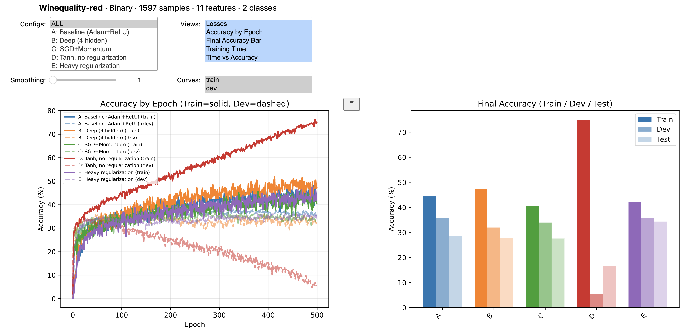
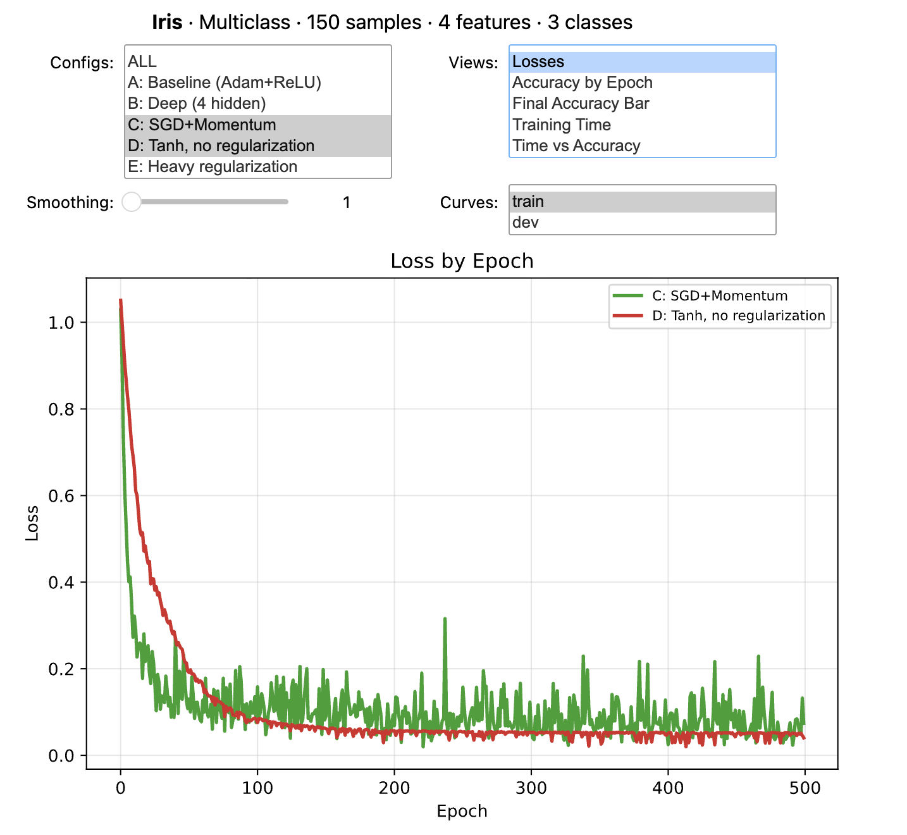
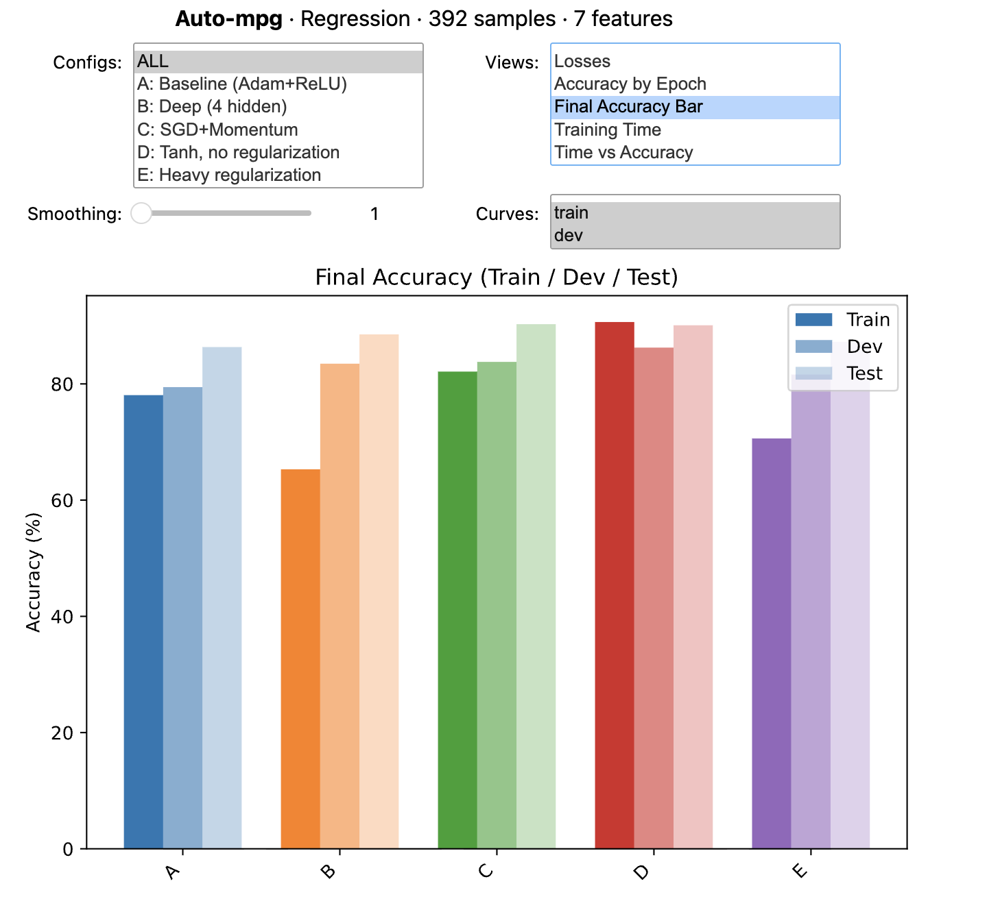
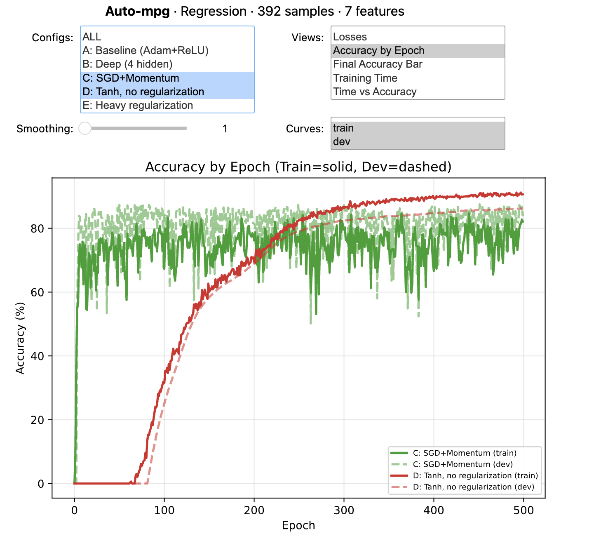
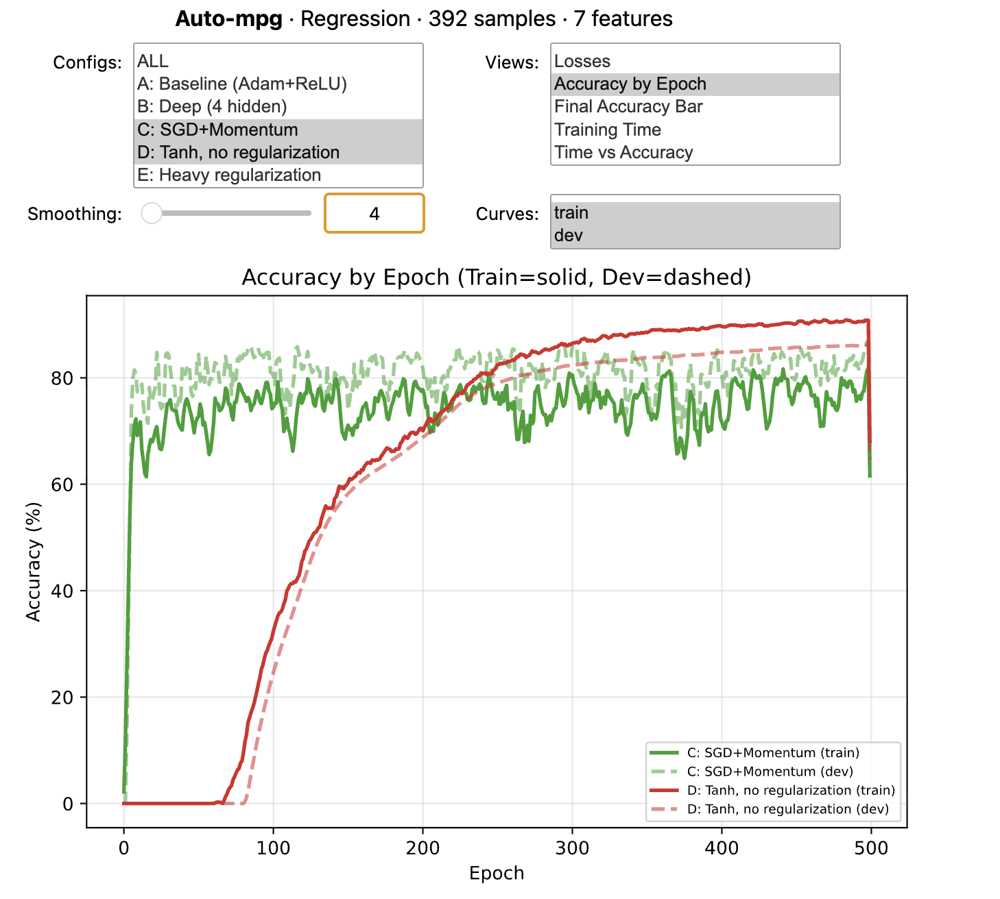
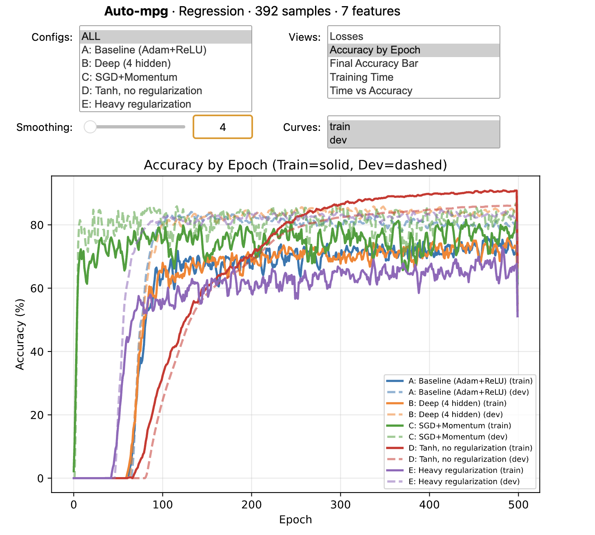
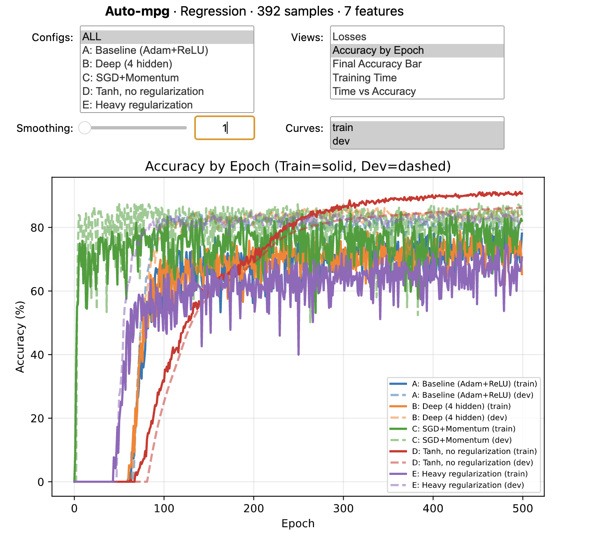
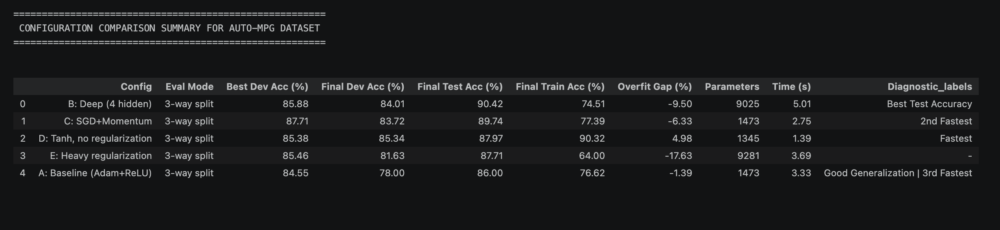

# ANN Architecture Explorer — Lite

A lightweight, interactive Jupyter notebook for comparing neural network architectures and hyperparameters side by side in an interactive dashboard. It's designed for quick experimentation and visualization of how different ANN configurations perform on the same dataset.

You can:
- **Run the notebook directly** without making any changes (sample datasets and configurations are included)
  or
- **Customize it** by loading your own dataset and defining your own ANN configurations with the provided template and parameter reference. Cells in which you can make changes are clearly marked with comments. The rest of the notebook is ready to run as-is, with no code changes needed beyond defining your dataset and configs


https://github.com/user-attachments/assets/d7fbb53d-af14-4d5e-91e8-0b51ffcd9d10

---

## What It Does

This notebook lets you define multiple ANN configurations (architecture, optimizer, activation function, regularization, etc.) and trains them all on the same dataset (3 sample datasets and 5 sample configs are provided).
Results are displayed through interactive comparison plots powered by `ipywidgets`, letting you filter configs, toggle train/dev curves, adjust smoothing, and switch between views on the fly.


Three task types are supported out of the box:

- **Multiclass classification** — evaluated with accuracy (%), using `CrossEntropyLoss`
- **Binary classification** — evaluated with accuracy (%), using `BCEWithLogitsLoss`
- **Regression** — evaluated with R² scaled to 0–100%, using `MSELoss`, `L1Loss`, or `HuberLoss`

The notebook auto-detects the task type from your labels and adjusts the loss function and evaluation metric accordingly.

### Sample Datasets

Three datasets are included for quick testing:

| Dataset | Task | Samples | Features | Classes |
|---|---|---|---|---|
| **Iris** | Multiclass | 150 | 4 | 3 |
| **Wine Quality** (red) | Binary | 1,597 | 11 | 2 |
| **Auto MPG** | Regression | 392 | 7 | — |

A template is provided for loading your own dataset — just define `features` and `labels` arrays in the required format (see Section 1 of the notebook for details).

### Sample Configurations

Five example ANN configurations are included to demonstrate different architectures, optimizers, activation functions, and regularization strategies:

| Config | Architecture | Activation | Optimizer | Regularization | Purpose |
|---|---|---|---|---|---|
| A: Baseline | 2 hidden (32, 32) | ReLU | Adam | Dropout 0.2, BatchNorm, L2 1e-4 | Conservative reference point |
| B: Deep | 4 hidden (32, 64, 64, 32) | ReLU | Adam | Dropout 0.2, BatchNorm, L2 1e-4 | Test if more layers help |
| C: SGD+Momentum | 2 hidden (32, 32) | ReLU | SGD (lr=0.01) | Dropout 0.2, BatchNorm, L2 1e-4 | Compare optimizer dynamics |
| D: Tanh, no reg | 2 hidden (32, 32) | Tanh | Adam | None | Show effect of removing regularization |
| E: Heavy reg | 3 hidden (64, 64, 64) | ReLU | AdamW | Dropout 0.4, BatchNorm, L2 1e-2, L1 1e-4 | Test aggressive regularization |

A template is provided for defining your own configs — just create dictionaries with the required keys (see Section 2 of the notebook for details).

### Interactive Plots for comparing neural network architectures and hyperparameters

The selected dataset and ANN configurations are trained and their individual performance is evaluated, with results displayed in an interactive dashboard.
Five plot views are available, selectable via widget toggles:

| View | What it shows |
|---|---|
| **Loss by Epoch** | Training loss curves for all selected configs |
| **Accuracy by Epoch** | Train (solid) and dev (dashed) accuracy/R² over time |
| **Final Accuracy Bar** | Side-by-side train/dev/test comparison per config |
| **Training Time** | Horizontal bar chart of wall-clock training time |
| **Time vs Accuracy** | Scatter plot — efficiency vs. performance tradeoff |

You can compare all configs against each other at once including train, dev and test performance, or filter to specific configs and toggle between train/dev curves for a cleaner view of training dynamics:

<p align="center">
  
</p>
<p align="center"><i>Wine Quality dataset (binary) — all five interactive views displayed at once. Side scroll to view all</i></p>

<p align="center">
  
  
</p>
<p align="center"><i>Comparing toggle options. <br>Left: Iris dataset (multiclass) - Filtering to compare SGD+Momentum vs. Tanh (no regularization) training loss without dev loss curves · <br>Right: Auto MPG dataset (regression) - Comparing Final accuracy for train, dev and test sets across all configurations</i></p>


The smoothing slider helps read noisy training curves, especially useful for regression and small datasets:

<p align="center">
  
  
</p>
<p align="center"><i>Comparing training and dev loss for SGD+Momentum vs. Tanh (no regularization). <br>Left: raw R² curves (smoothing=1) · <br>Right: smoothed (smoothing=4)</i></p>

<p align="center">
  
  
</p>
<p align="center"><i>Comparing training and dev loss for all configurations. <br>Left: raw R² curves (smoothing=1) · <br>Right: smoothed (smoothing=4)</i></p>


### Summary Table

After training, a summary table with automatic diagnostic labels is generated — flagging overfitting, underfitting, generalization quality, and relative speed.

<p align="center">
  
</p>
<p align="center"><i>Auto MPG — final performance summary table with diagnostic labels for each configuration</i></p>

---

## How to Use

Open the notebook in Jupyter, VS Code or Colab and follow the sections in order:

**OPTION A: No changes needed —** 
just run all cells as-is to see the included configurations run on the Auto-MPG dataset (Regression). DONE

**OPTION B: Customize your dataset and configurations —** 
follow the steps below to load your own data and define your own ANN configs. 
Only Sections 1b and 2b have to be customized. Then run all cells from Section 2b onward to train and visualize results:

1. **Section 1** — Pick a sample dataset in Section 1a or load your own in Section 1b (provide `features` and `labels` as arrays). Run the cell containing the selected dataset. DO NOT RUN the other sample dataset cells — they will overwrite your choice.
2. **Section 2** — Use the 5 provided example configurations from Section 2a or define your own configurations in cell 2b.
3. **Section 2c+** — Run All Cells — no code changes needed beyond defining your dataset and configs. The training and visualization sections are ready to run as-is.

Each code cell is commented on its first line with either 
- "EDIT OPTIONAL" (for cells you can modify) - only cells 1b and 2b 
- "Do not edit" (for cells that are ready to run and should be left as-is) - all other cells

### Load Your Own Dataset
To load your own data in Section 1b, you need two variables:
- `features`: shape `(n_samples, n_features)`, dtype `float32`
- `labels`: shape `(n_samples,)` — integer codes for classification, continuous values for regression

### Create Your Own Configurations
To create your own ANN configurations in Section 2b, define dictionaries with the required keys (see template in the notebook). 
Each dictionary represents one configuration to be trained and compared against the others.


Each config is a dictionary with these keys:

| Parameter | What it controls | Example values |
|---|---|---|
| `layer_sizes` | Network architecture | `[7, 32, 32, 1]` |
| `actfun` | Activation function | `'relu'`, `'tanh'`, `'gelu'`, `'selu'`, `'sigmoid'`, `'leaky_relu'`, `'elu'`, `'silu'` |
| `leaky_slope` | LeakyReLU negative slope | `0.01` (only used if `actfun='leaky_relu'`) |
| `learning_rate` | Optimizer step size | `0.001` (Adam), `0.01` (SGD) |
| `num_epochs` | Training passes | `500` |
| `batch_size` | Samples per update | `16`, `32`, `64`, `128` |
| `optimizer` | Update algorithm | `'adam'`, `'sgd'`, `'adamw'`, `'rmsprop'`, `'adagrad'` |
| `momentum` | SGD/RMSprop momentum | `0.9` (only used for `'sgd'`/`'rmsprop'`) |
| `loss_function` | Loss function | `'bce_logits'`, `'cross_entropy'`, `'mse'`, `'l1'`, `'huber'` |
| `dropout_rate` | Neuron drop fraction | `0.0` – `0.5` |
| `use_batchnorm` | Batch normalization | `True` / `False` |
| `weight_decay` | L2 regularization | `0.0` – `0.01` |
| `l1_lambda` | L1 regularization | `0.0` – `0.001` |
| `dev_size` | Dev set fraction | `0.15` |
| `test_size` | Test set fraction | `0.15` |
| `use_kfold` | k-fold cross-validation | `True` / `False` |
| `n_folds` | Number of folds | `5` (only used if `use_kfold=True`) |

The full parameter reference table is also included in the markdown cell in Section 2 of the notebook.

### Data Split Strategy

```
Full Dataset
├── Train  (70%)  → gradient updates during training
├── Dev    (15%)  → per-epoch accuracy monitoring & config selection
└── Test   (15%)  → touched ONCE at the end for unbiased final evaluation
```

Alternatively, enable k-fold cross-validation for small datasets (`use_kfold=True`).

---

## Setup

**Requirements:** Python 3.10+ and the packages listed in `ANN_ArchEx_lite_requirements.txt`.

```bash
# Clone the repo
git clone https://github.com/emmalieker/ANN-Architecture-Explorer-Lite.git
cd ANN-Architecture-Explorer-Lite

# Create a virtual environment (recommended)
python -m venv .venv
source .venv/bin/activate        # macOS/Linux
# .venv\Scripts\activate         # Windows

# Install dependencies
pip install -r ANN_ArchEx_lite_requirements.txt

# Launch the notebook
jupyter notebook ANN_ArchEx_lite.ipynb
# or in VS Code or Colab: open the .ipynb file directly
```

### Dependencies

- `torch` — model building and training
- `numpy`, `pandas` — data handling
- `matplotlib` — plotting
- `scikit-learn` — train/test splitting, k-fold CV
- `scipy` — Z-score normalization
- `ipywidgets` — interactive plot controls
- `ipykernel` — Jupyter kernel support

---

## Project Structure

```
ANN_ArchEx_lite/
├── ANN_ArchEx_lite.ipynb                 # Main notebook
├── ANN_ArchEx_lite_requirements.txt      # pip dependencies
├── DemoFiles/                            # Screenshots and video used in this README
│   ├── Auto_DemoRec01.mp4                # Demo video
│   ├── Auto_DemoShot01.png               # Interactive plot
│   ├── Auto_DemoShot02.png               # Interactive plot
│   ├── Auto_DemoShot03.png               # Interactive plot
│   ├── Auto_DemoShot04.png               # Interactive plot
│   ├── Auto_DemoShot05.png               # Interactive plot
│   ├── Auto_DemoSum01.png                # Final performance summary table with diagnostic labels
│   ├── Iris_DemoShot01.png               # Interactive plot
│   └── Wine_DemoShot01.png               # Interactive plot
└── README.md
```

---

## Notes

- The notebook is designed as a teaching and exploration tool — not a production training pipeline.
- For persistent results with CSV/JSON export, multi-run tracking, and HTML reports, see the full **ANN Architecture Explorer**.
- Regression metrics use R² (coefficient of determination) scaled to 0–100% for visual consistency with classification accuracy. Negative R² values (model worse than predicting the mean) are clipped to 0 in Section 3. To see the raw R² values, change the following line in the notebook:

change from:
```python
# return 100 * r2.item()            
return max(0, 100 * r2.item())
```
to:
```python
return 100 * r2.item()
# return max(0, 100 * r2.item())
```
